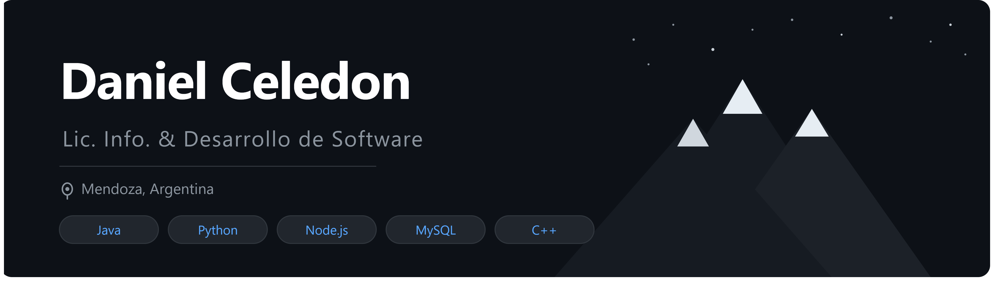

# Hey, I'm Daniel 👋

I'm a **Software Developer** and third-year student of *Licenciatura en Informática y Desarrollo de Software* at Universidad del Aconcagua, Mendoza, Argentina.

I build real projects — desktop apps, web platforms, multiplayer chat servers, and even a card game with a neural network opponent. I care about clean architecture, good teamwork, and shipping things that actually work.

---

## 🛠️ Tech Stack

**Languages**

**Frameworks & Libraries**

**Databases**

**Tools & Practices**

**AI / ML**

---

## 🚀 Featured Projects

### 🃏 [Truco Argentino con IA](https://github.com/Daniel6051/Truco-Argentino-Con-IA)
Full implementation of the Argentine card game *Truco* with an AI opponent built on 2 neural networks and 3 perceptrons. Complete game logic (cantos, envido, mazo), MVC architecture, and a Swing GUI.
`Java` · `Swing` · `MVC` · `Neural Networks`

### 📦 [Stock & Sales Control System](https://github.com/Daniel6051/proyecto-grupal)
Desktop app for inventory and sales management, adaptable to any business. Includes minimum stock alerts and report export in PDF and Excel. Built in a team with Git branching workflow.
`Python` · `MySQL` · `tkinter` · `SQLAlchemy` · `ReportLab` · `OpenPyXL`

### 🏥 SaludExpress — Health Insurance Platform
Web platform for managing a health insurance service: patient and doctor registration, in-person and virtual appointments, coverage plans, and MercadoPago payment integration.
`PHP` · `MySQL` · `Node.js` · `Express` · `Bootstrap` · `MercadoPago`

### 💬 Multithreaded Chat Server with MathBot
Multithreaded server with a Swing client supporting simultaneous connections, input validation, marketplace commands, and automatic math expression solving.
`Java` · `Sockets` · `Threads` · `Swing`

---

## 📚 Education

- 🎓 **Licenciatura en Informática y Desarrollo de Software** — Universidad del Aconcagua (3rd year, ongoing)
- 💻 **Full Stack Developer Program** — Escuelas Newton · *Graduated top of cohort*

---

## 📊 GitHub Stats

  
  

---

## 📫 Get in touch

